# 使用说明

## [Eclipse]Eclipse中自定义Servlet模板

Eclipse新建Servlet时，以软件默认模板生成的Servlet会有很多内容，其中有一些是没有必要的文档注释，这些多余的内容看起来会让人不舒服。
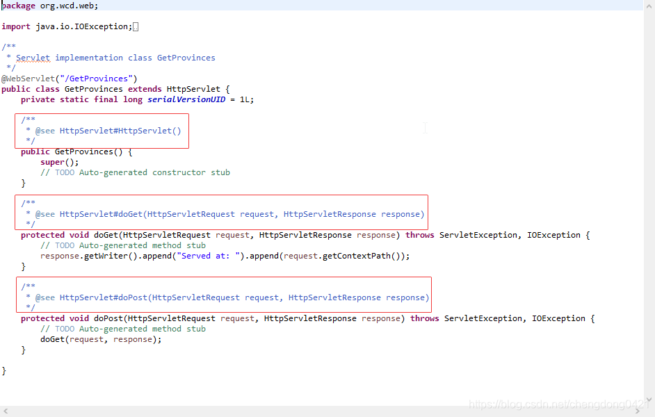

网上有很多文章介绍的方法是使用代码编辑器的模板[Templates]来达到自定义servlet模板的目的，但这种方法还是有些麻烦。各种百度终于找到了Servlet模板的位置并找到了自定义该模板的方法。

### 1. Servlet模板路径

Servlet模板位于`${eclipse安装目录}\plugins\org.eclipse.jst.j2ee.web_${版本号}.jar`包下，该包内的`org.eclipse.jst.j2ee.internal.web.operations.ServletTemplate.class`就是新建Servlet的模板类。在同一路径下还有`FilterTemplate.class`和`ListenerTemplate.class`两个类，分别是Filter和Listener的模板类。我们只需要修改这几个类然后替换就行了。

### 2. 生成源码并编译

我们可以通过下载源码然后直接修改源码的方式来修改这几个类。但是这几个模板类的源码实际上是由模板文件生成的，下载下来的源码并不是很容易看明白，直接修改费时费力。

我们可以按照源码原来的生成方式，通过修改模板文件来重新生成模板类的源码，然后再编译。模板文件位于`${eclipse安装目录}\plugins\org.eclipse.jst.j2ee.web_${版本号}.jar`包下，使用解压软件打开该jar包，根目录下有一个名为templates的文件夹
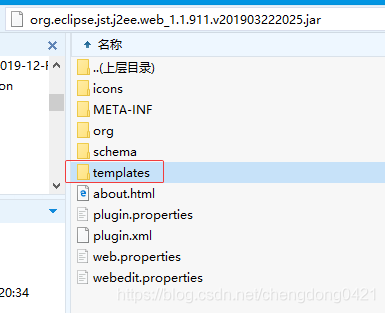

该文件夹内存放的就是模板文件及其他相关文件。其中*.javajet文件是模板文件，*.template文件通过<%@ include file="" %>语句包含在*.javajet文件文件中使用。
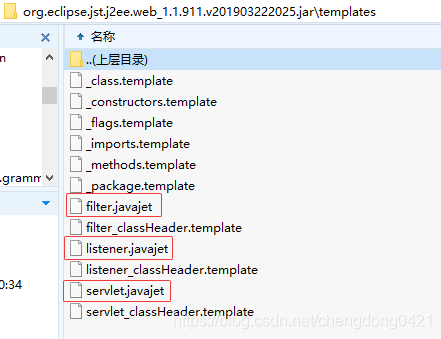

从模板文件生成源码用到了JET(Java Emitter Templates)工具（JET详细介绍参见[JET Tutorial Part 1](https://www.eclipse.org/articles/Article-JET/jet_tutorial1.html)和[JET Tutorial Part 2](https://www.eclipse.org/articles/Article-JET2/jet_tutorial2.html)），我们只需要了解一些简单的内容即可完成今天的任务。

#### 下面我们就开始完成Servlet模板自定义的任务：

> 所需工具：
> Eclipse for javaEE

**1.** 安装并打开Eclipse
**2.** 创建一个java项目（jdk选择1.8版本，我用的是1.8版，其他版本没有测试）
**3.** 右键项目根目录，选择 `New -> Other`

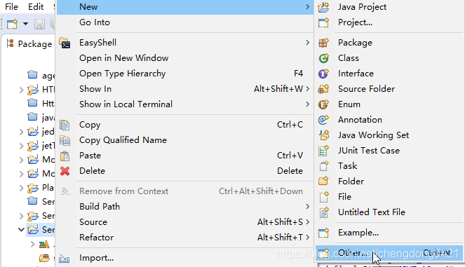

**4.** 在弹出的对话框里输入jet，在下面选择 `Convert Projects To JET Projects` ，点击 `Next`

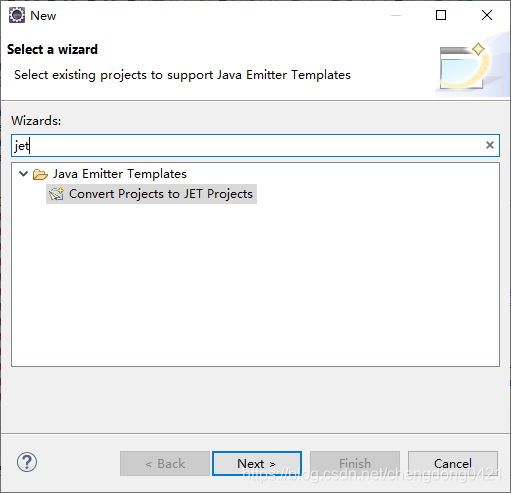

**5.** 然后勾选新建的项目，点击Finish

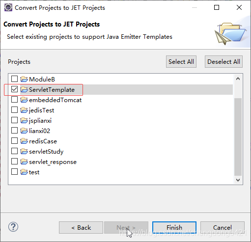

**6.** 点击Finish后会弹出一个设置界面，按下图红框中填写(默认的就是这样，如果不是，则修改)，填写好点击`Apply and Close`

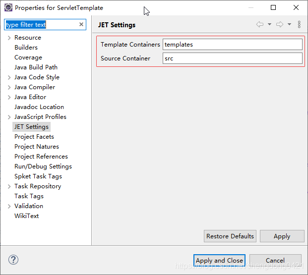

这样设置好后项目结构如下，会在项目根目录下生成一个templates文件夹：
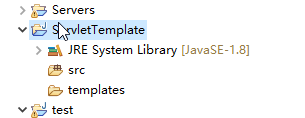
**7.** 从Eclipse的安装目录下的plugins文件夹里找到以下两个jar包：
`org.eclipse.jst.j2ee.web_${版本号}.jar`
`org.eclipse.jst.j2ee_${版本号}.jar`
将这两个jar包添加到项目Build Path中,如下图

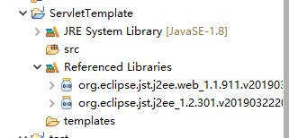

**8.** 然后展开Build Path下的org.eclipse.jst.j2ee.web包，将其下templates文件夹下的所有文件复制到项目根目录下的templates文件夹下。
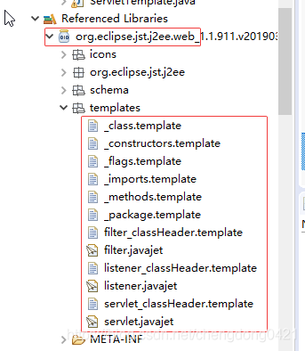
复制完成后，项目结构如下图，此时我们发现src目录下已经生成了Servlet模板类的源码（每当我们修改了templates目录下的*.javajet文件并保存都会重新生成源码）：
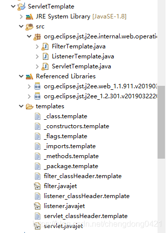

此时生成的源码还是原来的模板，不是我们想要的。我们接下来要做的就是修改templates目录下的相关文件来生成我们想要的模板类源码，比如去掉模板生成的Servlet中的文档注释。

双击打开 **servlet.javajet** 文件，从文件内容可以看出，该文件实际上是由一些jsp语句和java语句组成的

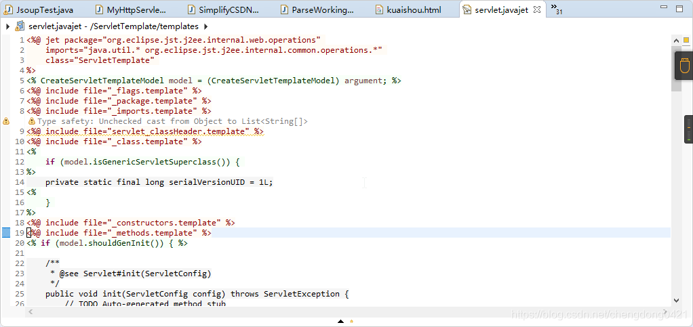
我们找到所有的文档注释代码，将其删除并保存

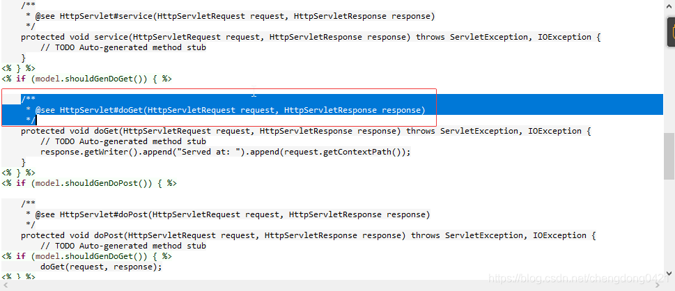
这样模板生成的Servlet就不再有文档注释了。也可以添加其他代码，比如在doGet方法体内添上response.setContentType(…)等等，按你自己需要修改就可以了。

Filter和Listener模板的修改同理。

有一些文档注释是在 ***.template** 文件中的，比如构造方法的文档注释，我们需要打开_constructors.template文件，删除其中代码保存。保存后会重新生成源码。

如果eclipse设置了保存源码自动编译，那就可以直接去找编译后的class文件了，如果没有设置，就手动编译一下生成的源码。

接下来，**关闭eclipse**，用解压软件打开`${eclipse安装目录}\plugins\org.eclipse.jst.j2ee.web_${版本号}.jar`(**打开就行，不要解压**)，找到该包下`org/eclipse/jst/j2ee/internal/web/operations`路径，将生成的class文件拖进去覆盖就可以了。（**覆盖前记得备份一下jar包**）

不出意外的话，打开eclipse，新建Servlet就是自定义的模板了。

**注：** 如果Eclipse升级更新了`${eclipse安装目录}\plugins\org.eclipse.jst.j2ee.web_${版本号}.jar`包，则需要重新改一下模板类

------

修改模板后新建的Servlet示例：
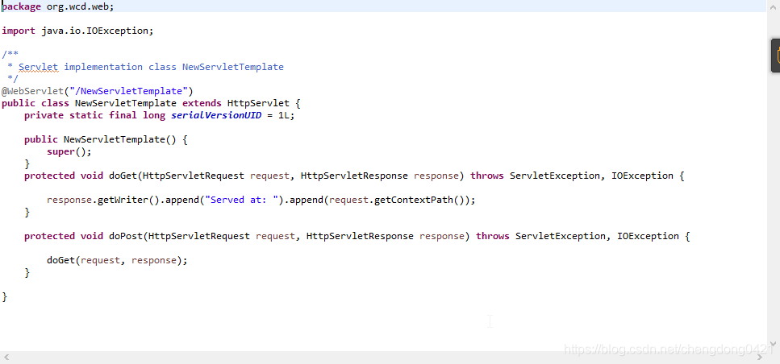